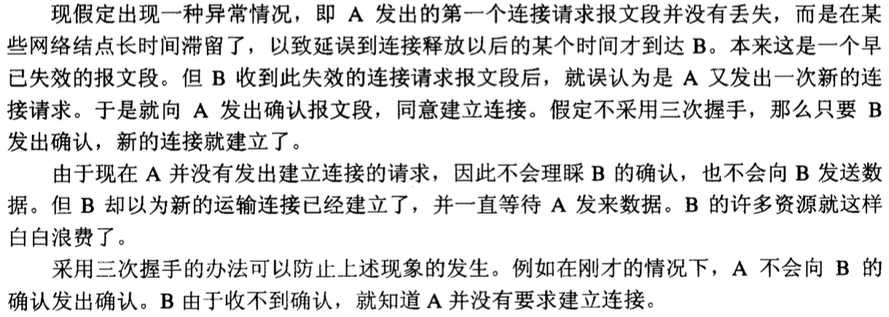
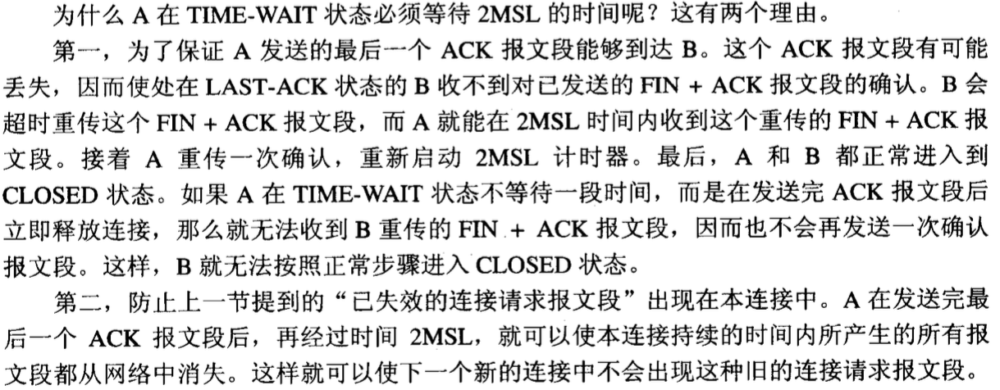

# 三次握手、四次握手内容整理

> 来源：https://blog.csdn.net/qq_18425655/article/details/52163228

1. 三次握手状态：SYN_SENT - SYN_RECV - ESTABLISHED
2. 为什么要采用三次握手，两次不行吗？

1. 四次握手

1. 为什么A在TIME-WAIT状态必须等待2MSL的时间？（MSL(Maximum Segment Lifetime)报文最长存活时间）

1. 保活计时器:设想有这样的情况：客户端已主动与服务器建立了TCP连接，但后来客户端的主机突然出现故障。通常设为2小时。若2小时没有收到客户端的数据，服务器就发送一个探测报文段，以后则每隔75分钟发送一次。若一连发送10个探测报文段后仍无客户端的响应，服务器就认为客户端出现了故障，接着就关闭这个连接。
2. 为什么连接的时候是三次握手，关闭的时候却是四次握手:因为当Server端收到Client端的SYN连接请求报文后，可以直接发送SYN+ACK报文。其中ACK报文是用来应答的，SYN报文是用来同步的。但是关闭连接时，当Server端收到FIN报文时，很可能并不会立即关闭SOCKET，所以只能先回复一个ACK报文，告诉Client端，"你发的FIN报文我收到了"。只有等到我Server端所有的报文都发送完了，我才能发送FIN报文，因此不能一起发送。故需要四步握手。

