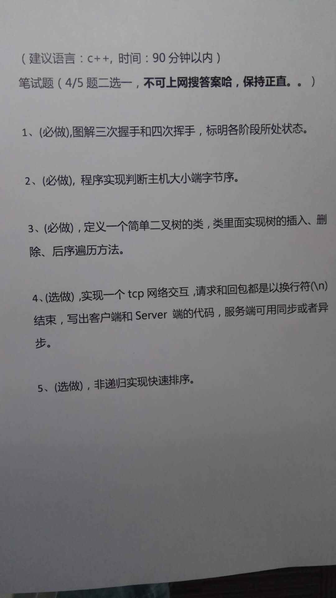

# 腾讯面试

>> 出处：王桃

笔试题（手写）：

1. 自己对状态（单词也会写错）不是很熟，需要写上seq、ack的值。四次挥手自己很不熟
2. 要深入理解big-endian的含义，也做下大小端转换，代码参看：[代码](endian.c)
3. 

## 引申：
1. 注意快排中的partition思想，可能会用在1000个数找前一百个数的算法中
2. top K问题，来源：http://doc.okbase.net/zyq522376829/archive/169290.html
3. 静态链接库和动态链接库若出现同函数名重名，会怎么样？
4. 若发现电脑很卡，该怎么解决？