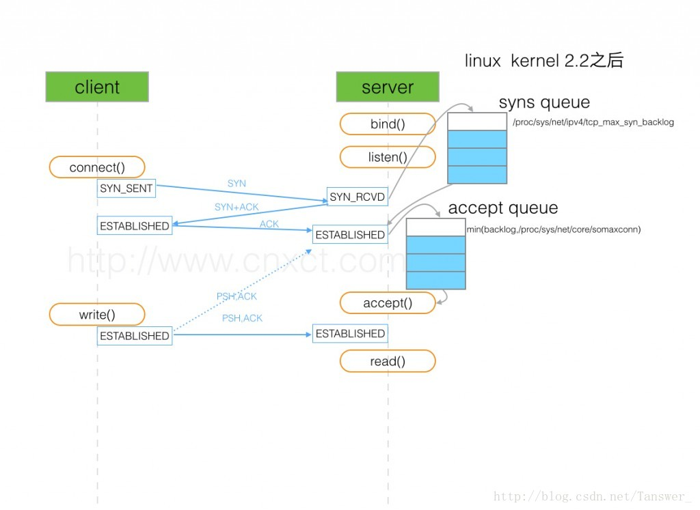
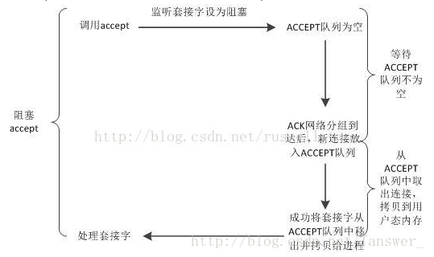
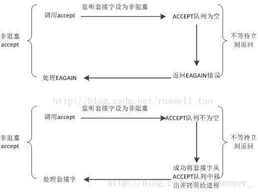

>> 学习网站:http://www.omnisecu.com/

1. SYN队列（半连接队列）|ACCEPT队列（全连接队列）
2. TCP握手过程中建连接的流程和队列

## 队满时会发生什么
- 为什么有的应用服务器进程，会单独使用一个线程去调用accept来建立服务端和客户端的连接，比如tomcat；而有的则是一个线程做所有的事，即获取连接后还会做I/O等其他操作？
- - 第一种情况：SYN队列满。如果SYN队列满，则会直接丢弃连接请求。 
比如syn floods 攻击就是针对半连接队列（SYN队列）的，攻击方不停地建连接，但是建连接的时候只做第一步，第二步中攻击方收到server的syn+ack后故意扔掉什么也不做，server需要一个超时时间把这个连接断开，否则大量这样的连接导致server上这个队列满其它正常请求无法进来。
- - 第二种情况：ACCEPT队列满。
我的理解是接收ACK的速率非常快，快过了从ACCEPT队列中获取的速率，故ACCEPT队列会满。
- 一般 overflowed 表示全连接队列溢出次数，socket ignored 表示半连接队列溢出次数，这两个是同步增加的，overflow的时候一定会socket ignored++？？
- - 所以对应用服务器进程来说，如果ACCEPT队列中有已经建立好的TCP连接，却没有及时的把它取出来，这样一旦导致两个队列满后就会使客户端不能再建立新的连接，引发严重问题。所以，比如tomcat等服务器会用独立的线程只做accept获取连接这一件事，以防止不能及时的去accept获取连接。
- - 阻塞套接字，accept行为如右

- - 非阻塞套接字，accept行为如右

- - 所以，企业级的服务器进程中，若某一线程既使用accept获取新连接，又继续在这个连接上读、写字符流，那么，这个连接对应的套接字通常要设为非阻塞。？？
- 若client走完第三步，那么在client看来连接已经建立好了，但是server上实际没有准备好，如果这时候client发数据给server，server怎么处理呢？
- - client发送一个数据包给server后，server上的这个连接实际没有ready，server一直没有回复，一段时间后client认为丢包了，然后重传这个包，一直到超时，client主动发FIN包断开连接。
