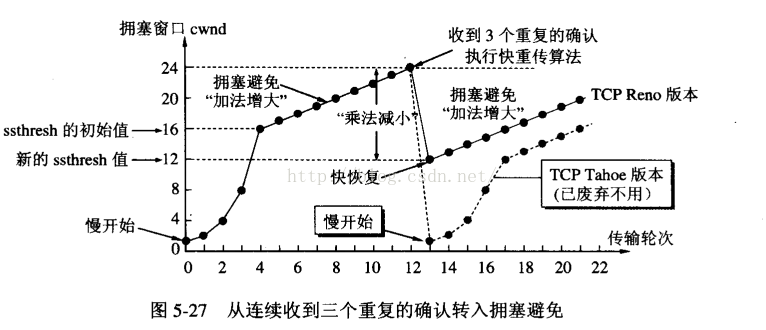

# 滑动窗口
>> 原网站：http://www.omnisecu.com/tcpip/tcp-sliding-window.php

>> flash demo：http://www2.rad.com/networks/2004/sliding_window/

## 原理
- 发送端在接收到一个ack后（比如说发送12345接收到了1的ack），这时候滑动窗口会向右滑动一个位置
- 当发送端发送12345后，3在中途丢失，则此时接收端会发送已经接收好的最大包的序号，即2.发送收到2后重新发送34567（假设这里滑动窗口大小是5）
- 接收端的窗口永远指向的是已经接收好的最大包序号的后一位

## 流量控制
- 通过TCP接收窗口大小控制发送窗口流量限制。
- 应用程序在需要（如内存不足）时，通过API通知TCP协议栈缩小TCP的接收窗口。然后TCP协议栈在下个段发送时包含新的窗口大小通知给对端，对端按通知的窗口来改变发送窗口，以此达到减缓发送速率的目的。

## 拥塞控制
- 拥塞窗口：发送方为一个动态变化的窗口叫做拥塞窗口，拥塞窗口的大小取决于网络的拥塞程度。发送方让自己的发送窗口=拥塞窗口，但是发送窗口不是一直等于拥塞窗口的，在网络情况好的时候，拥塞窗口不断的增加，发送方的窗口自然也随着增加，但是接受方的接受能力有限，在发送方的窗口达到某个大小时就不在发生变化了。
- 发送方怎么知道网络拥塞了呢：发送方发送一些报文段时，如果发送方没有在时间间隔内收到接收方的确认报文段，则就可以认为网络出现了拥塞。
### 慢启动
- 主机开发发送数据报时，如果立即将大量的数据注入到网络中，可能会出现网络的拥塞。慢启动算法就是在主机刚开始发送数据报的时候先探测一下网络的状况，如果网络状况良好，发送方每发送一次文段都能正确的接受确认报文段。那么就从小到大的增加拥塞窗口的大小，即增加发送窗口的大小。（成倍增大）
- 例子：开始发送方先设置cwnd（拥塞窗口）=1,发送第一个报文段M1，接收方接收到M1后，发送方接收到接收方的确认后，把cwnd增加到2，接着发送方发送M2、M3，发送方接收到接收方发送的确认后cwnd增加到4，慢启动算法每经过一个传输轮次（认为发送方都成功接收接收方的确认），拥塞窗口cwnd就加倍。
### 拥塞避免
- 从慢启动可以看到，cwnd可以很快的增长上来，从而最大程度利用网络带宽资源，但是cwnd不能一直这样无限增长下去，一定需要某个限制。TCP使用了一个叫慢启动门限(ssthresh)的变量，当cwnd超过该值后，慢启动过程结束，进入拥塞避免阶段。对于大多数TCP实现来说，ssthresh的值是65536(同样以字节计算)。拥塞避免的主要思想是加法增大，也就是cwnd的值不再指数级往上升，开始加法增加。此时当窗口中所有的报文段都被确认时，cwnd的大小加1，cwnd的值就随着RTT开始线性增加，这样就可以避免增长过快导致网络拥塞，慢慢的增加调整到网络的最佳值。
### AIMD原则（加法增大、乘法减小）
- 上面讨论的两个机制都是没有检测到拥塞的情况下的行为，那么当发现拥塞了cwnd又该怎样去调整呢：首先来看TCP是如何确定网络进入了拥塞状态的，TCP认为网络拥塞的主要依据是它重传了一个报文段。上面提到过，TCP对每一个报文段都有一个定时器，称为重传定时器(RTO)，当RTO超时且还没有得到数据确认，那么TCP就会对该报文段进行重传，当发生超时时，那么出现拥塞的可能性就很大，某个报文段可能在网络中某处丢失，并且后续的报文段也没有了消息，在这种情况下，TCP反应比较“强烈”
- 把ssthresh降低为cwnd值的一半
- 把cwnd重新设置为1
- 重新进入慢启动过程
- 从整体上来讲，TCP拥塞控制窗口变化的原则是AIMD原则，即加法增大、乘法减小。可以看出TCP的该原则可以较好地保证流之间的公平性，因为一旦出现丢包，那么立即减半退避，可以给其他新建的流留有足够的空间，从而保证整个的公平性。
### 快重传（Fast Retransmit）
- 要求接收方每收到一个失序的报文段后就立即发出重复确认而不是等待自己发送数据时才捎带确认
- 发送方只要一连收到三个重复确认就立即重传对方尚未收到的报文段，而不必等待设置的重传计时器到期
- 把ssthresh设置为cwnd的一半
- 把cwnd再设置为ssthresh的值(具体实现有些为ssthresh+3)（原因是认为收到三个重复确认后，表明网络中已经有三个分组离开了，证明现在网络中并没有堆积分组，因此适当增大拥塞窗口）（不是很懂）

### 快恢复（Fast Recovery）

- 当发送方连续接收到三个确认时，就执行乘法减小算法，把慢启动开始门限（ssthresh）减半，但是接下来并不执行慢开始算法。
- 此时不执行慢启动算法，而是把cwnd设置为ssthresh的一半， 然后执行拥塞避免算法，使拥塞窗口缓慢增大。
