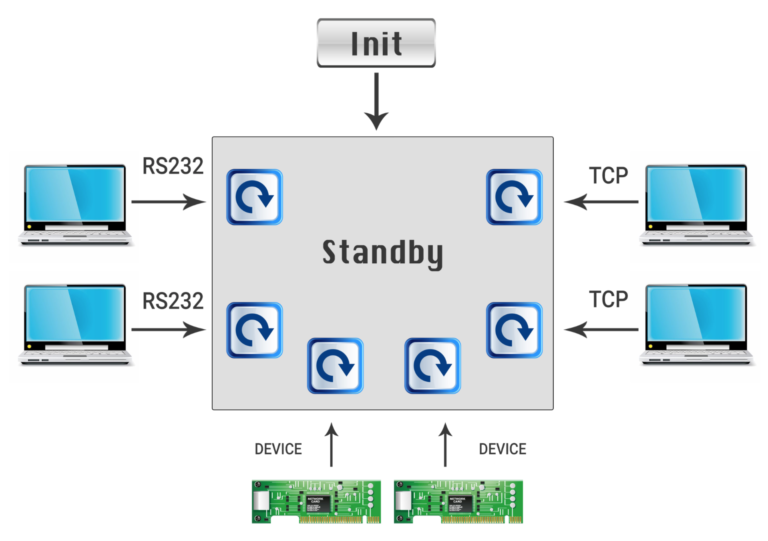

# SELECT VS POLL VS EPOLL

>> 来源：http://devarea.com/linux-io-multiplexing-select-vs-poll-vs-epoll/#.WzRJpDozbIV

- linux中所有东西都是文件，每个进程都有一个文件描述符表，这个表指向文件、socket、设备等等
- 典型的系统工作流程如下：
 
- 简单的解决思路是为每个客户端建立一个线程。当客户量比较少时还可以，但量很大的时候就不行了。
## IO 复用
- 解决方案是使用内核机制来轮询一组文件描述符。有三个选项可以使用：select、poll、epoll
### select
```
int select(int nfds, fd_set *readfds, fd_set *writefds, fd_set *exceptfds, struct timeval *timeout);
```
- select函数第一个参数是指集合中所有文件描述符的范围，即所有文件描述符的最大值加1。
- 调用select会堵塞线程，知道文件描述符准备好读写了，或者超时了。
- readfds中的文件描述符是用来监视数据是否可读
- writefds中的文件描述符是用来监视是否一个写操作可以顺利进行
- exceptfds是用来查看是否有异常发生
- select函数成功返回时，每个fds都发生了变化，里面仅包含已经准备好读写的文件操作符
### select总结
1. 在每次调用select之前我们都要建立每个set
2. 每个文件描述符用一个bit来表示，linux中fd_set是一个32int的数组，其中可以存放1024个bit，故每次查找fd的时间是o（n）
3. 每次都要遍历各个文件描述符集合，去查看是否可以进行读写操作了
4. select的有点就是很轻便
## poll
- 跟select里面有三个文件描述符集合不同，poll函数中只有一个pollfd数据结构，比较简单
```
int poll (struct pollfd *fds, unsigned int nfds, int timeout);

struct pollfd {
      int fd;
      short events; 
      short revents;
};
```

```
  for (i=0;i<5;i++) 
  {
    memset(&client, 0, sizeof (client));
    addrlen = sizeof(client);
    pollfds[i].fd = accept(sockfd,(struct sockaddr*)&client, &addrlen);
    pollfds[i].events = POLLIN;
  }
  sleep(1);
  while(1){
  	puts("round again");
	poll(pollfds, 5, 50000);
 
	for(i=0;i<5;i++) {
		if (pollfds[i].revents & POLLIN){
			pollfds[i].revents = 0;
			memset(buffer,0,MAXBUF);
			read(pollfds[i].fd, buffer, MAXBUF);
			puts(buffer);
		}
	}
  }
```
- 跟select一样，我们需要查看每个pollfd对象，看其文件描述符是否可以读写。但不一样的是，我们不需要去重建文件描述符集合。
## Poll vs Select
- poll不需要像select一样计算最大的文件描述符值
- 对于大值的文件描述符，poll效率更高，直接就找到了，而不是像select一样遍历一遍文件描述符集合（0 - maxindex）
- select的文件描述符fd_set，大小是固定的。而对于poll来说，每个文件描述符一个结构体pollfd。
- select每次都改变了文件描述符集合，这使得用户必须去手动初始化。而poll则将input和output分开，每次用户只需要把output清零即可。
- select可移植性要好，有些Unix系统不支持poll
## epoll
- 当使用select和poll函数时，我们首先将在用户空间管理所有事，然后将set传入系统函数select和poll中。如果要是加一个socket fd，我们把它加入到set中，同时再次调用select和poll函数。
- epoll帮助我们在内核中创建并管理上下文。一共分为三步
- - epoll_create在内核中创建上下文
- - epoll_ctl对上下文进行添加和删除
- - epoll_wait等待上下文
```
  struct epoll_event events[5];
  int epfd = epoll_create(10);
  ...
  ...
  for (i=0;i<5;i++) 
  {
    static struct epoll_event ev;
    memset(&client, 0, sizeof (client));
    addrlen = sizeof(client);
    ev.data.fd = accept(sockfd,(struct sockaddr*)&client, &addrlen);
    ev.events = EPOLLIN;
    epoll_ctl(epfd, EPOLL_CTL_ADD, ev.data.fd, &ev); 
  }
  
  while(1){
  	puts("round again");
  	nfds = epoll_wait(epfd, events, 5, 10000);
	
	for(i=0;i<nfds;i++) {
			memset(buffer,0,MAXBUF);
			read(events[i].data.fd, buffer, MAXBUF);
			puts(buffer);
	}
  }
```
1. 开始先创建上下文，其中参数size是内核保证能够正确处理的最大句柄数，多于这个最大数时内核可不保证效果。
2. 在epoll等待时可以添加或删除文件描述符
3. epoll_wait仅仅返回已经准备好读写的文件描述符个数
4. epoll时间复杂度是O(1)
5. epoll是linux特有的，没有平台移植性

## select和epoll的性能差别
### select的缺点
1. 最大并发数限制：默认使用32个整数的32位，即32*32=1024来标识fd（即select函数的第一个参数）。虽然可修改，但是有以下第二点的瓶颈；
2. 效率低：每次都会线性扫描整个fd_set（从0到maxindex+1），集合越大速度越慢；
3. 内核/用户空间内存拷贝问题（之前的配置都是用户空间进行的，调用select函数进入内核空间）。
