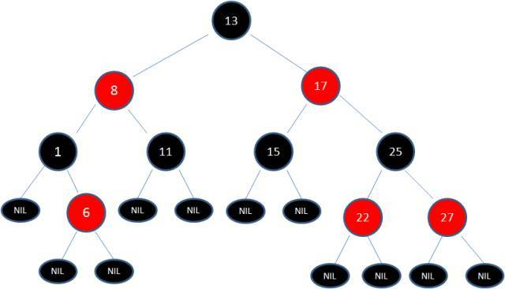
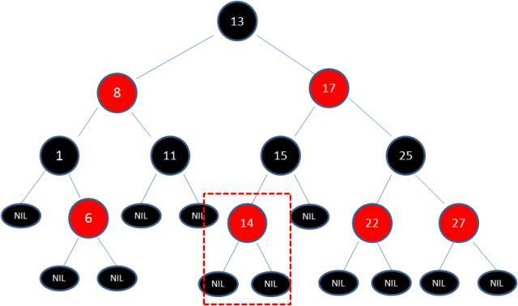
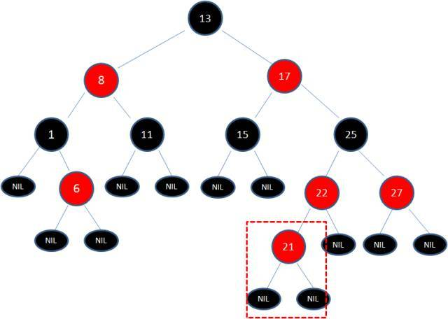
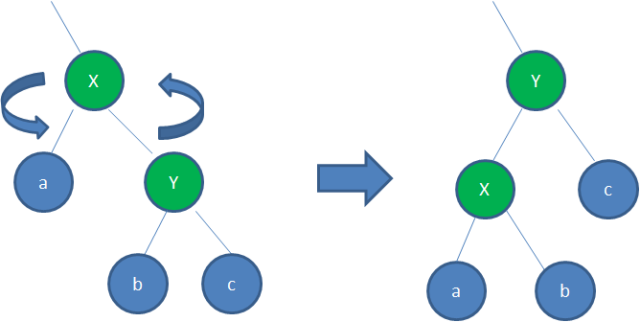
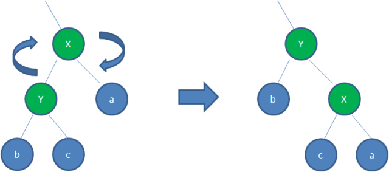

# 二叉排序树（二叉查找树BST）
1. 若左子树不空，则左子树上所有节点的值均小于它的根结构的值
2. 若右子树不空，则右子树上所有节点的值均大于它的根结构的值
3. 它的左右子树也分别为二叉排序树
4. 通过中序遍历即可输出排好序的值
5. 查找某一个值：二分查找法，查找所需的最大次数等同于二叉搜索树的高度

# 平衡二叉树
1. 是一种二叉排序树，其中每个节点的左子树和右子树的高度差不超过1
2. 当插入、删除较少时，用平衡二叉树（平衡二叉树插入会有更多的旋转），但平衡二叉树高度而言比红黑树有优势
3. 若插入、删除较多时，用红黑树
# 红黑树

>> 参考：https://www.sohu.com/a/201923614_466939

1. 节点是红色或黑色
2. 根节点是黑色
3. 每个叶子节点都是黑色的空节点（NIL节点）（nil表示无值，任何变量在没有被赋值之前的值都为nil）
4. 每个红色节点的两个子节点都是黑色。(从每个叶子到根的所有路径上不能有两个连续的红色节点)
5. 从任一节点到其每个叶子的所有路径都包含相同数目的黑色节点。
- 红黑树从根到叶子的最长路径不会超过最短路径的两倍
- 时间复杂度为O(log n)
- 三个节点构造不成红黑树
## 规则的破坏与修复
### 增加新节点不会破坏规则的案例

插在黑色节点之后
### 增加新节点会破坏规则的案例

插在红色节点之后
### 变色法
1. 为了重新符合红黑树的规则，尝试把红色节点变为黑色，或者把黑色节点变为红色。
### 左旋转

适用于父节点与右节点均是红色的情况
### 右旋转

适用于父节点与左节点均是红色的情况

