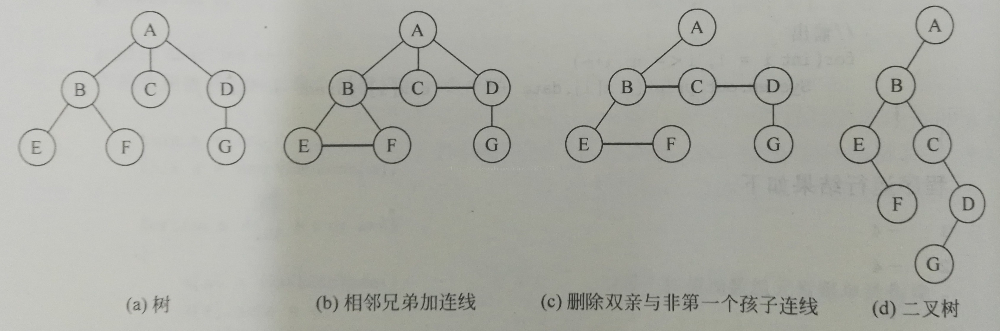
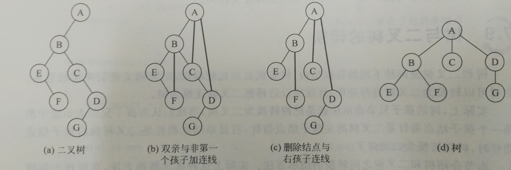

# 二叉树与树相互转换

## 树转换为二叉树过程
1. 树中所有相同双亲结点的兄弟结点之间加一条连线
2. 对树中不是双亲结点的第一个孩子的结点，只保留新添加的该结点与左兄弟结点之间的连线，删去该结点与双亲结点之间的连线
3. 整理所有保留的连线，根据连线摆放成二叉树的结构，转换完成。

## 二叉树转为树的过程
1. 若某结点是其双亲结点的左孩子，则把该结点的右孩子，右孩子的右孩子都与该结点的双亲结点用线连起来
2. 删除原二叉树中所有双亲结点与右孩子结点的连线
3. 整理所有保留的连线，根据连线摆放成树的结构，转换完成

