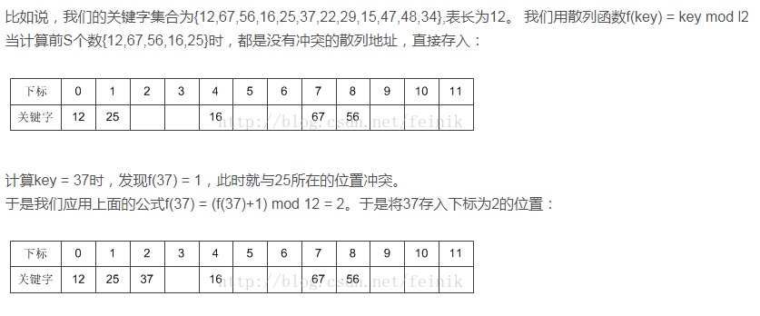
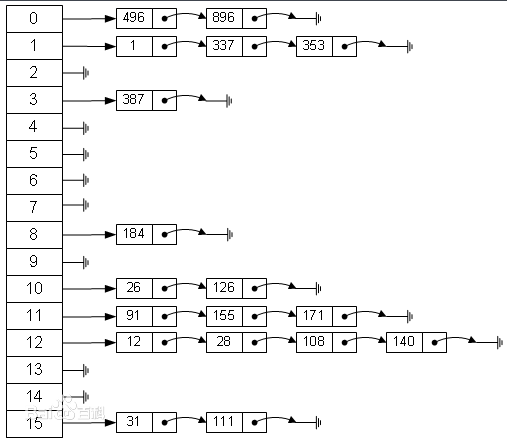
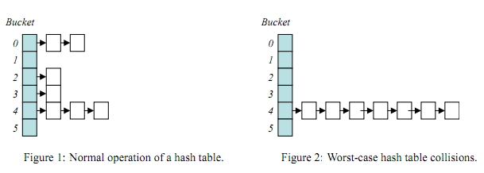

# 哈希表

## 定义
1. 键码映射，在公式里面，就是通过key去查找f(key)

## 哈希冲突
1. 公式上表达就是key1≠key2，但f(key1)=f(key2)
```
//比较好的哈希函数是time33算法。
unsigned long hash(const char* key){
    unsigned long hash=0;
    for(int i=0;i<strlen(key);i++){
        hash = hash*33+str[i];
    }  
    return hash;
}
```

## 哈希冲突解决办法
### 开放定址法
1. 所谓的开放定址法就是一旦发生了冲突，就去寻找下一个空的散列地址，只要散列表足够大，空的散列地址总能找到

### 再哈希法
1. 再哈希法又叫双哈希法，有多个不同的Hash函数，当发生冲突时，使用第二个，第三个，….，等哈希函数计算地址，直到无冲突。虽然不易发生聚集，但是增加了计算时间。
### 建立公共溢出区
1. 这种方法的基本思想是：将哈希表分为基本表和溢出表两部分，凡是和基本表发生冲突的元素，一律填入溢出表
### 链地址法

```
//构建哈希表
#define HASHSIZE 10
typedef unsigned int uint;
typedef struct Node{
    const char* key;
    const char* value;
    Node *next;
}Node;

class HashTable{
private:
    Node* node[HASHSIZE];
public:
    HashTable();
    uint hash(const char* key);
    Node* lookup(const char* key);
    bool install(const char* key,const char* value);
    const char* get(const char* key);
    void display();
};

//定义哈希表的构造方法
HashTable::HashTable(){
    for (int i = 0; i < HASHSIZE; ++i)
    {
        node[i] = NULL;
    }
}

//定义哈希表的Hash算法(传入键，返回一个值)
uint HashTable::hash(const char* key){
    uint hash=0;
    for (; *key; ++key)
    {
        hash=hash*33+*key;
    }
    return hash%HASHSIZE;
}

/* 定义一个根据key查找结点的方法，首先是用Hash函数计算头地址，然后根据头地址向下一个个去查找结点，如果结点的key和查找的key值相同，则匹配成功。 */
Node* HashTable::lookup(const char* key){
    Node *np;
    uint index;
    index = hash(key);
    for(np=node[index];np;np=np->next){
        if(!strcmp(key,np->key))
            return np;
    }
    return NULL;
}

/* 定义一个插入结点的方法，首先是查看该key值的结点是否存在，如果存在则更改value值就好，如果不存在，则插入新结点。 */
bool HashTable::install(const char* key,const char* value){
    uint index;
    Node *np;
    if(!(np=lookup(key))){
        index = hash(key);
        np = (Node*)malloc(sizeof(Node));
        if(!np) return false;
        np->key=key;
        np->next = node[index];
        node[index] = np;
    }
    np->value=value;
    return true;
}
```

## 关于哈希表的性能
