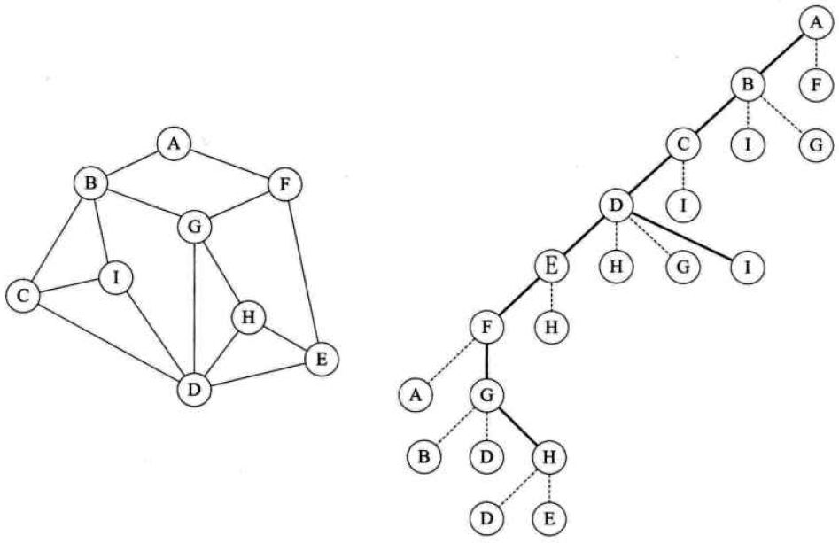

# 图的遍历
>>  图的遍历和树的遍历类似，我们希望从图中某一顶点出发访遍图中其余顶点，且使每个顶点仅被访问一次，这一过程就叫做图的遍历（Traversing Graph）。

## 深度优先遍历

```
//递归实现
（1）访问顶点v；visited[v]=1；//算法执行前visited[n]=0
（2）w=顶点v的第一个邻接点；
（3）while（w存在）  
           if（w未被访问）
                   从顶点w出发递归执行该算法； 
           w=顶点v的下一个邻接点；
//非递归实现
 （1）栈S初始化；visited[n]=0；
 （2）访问顶点v；visited[v]=1；顶点v入栈S
 （3）while(栈S非空)
            x=栈S的顶元素(不出栈)；
            if(存在并找到未被访问的x的邻接点w)
                    访问w；visited[w]=1；
                    w进栈;
            else
                    x出栈；
```
## 广度优先遍历
```
（1）初始化队列Q；visited[n]=0；
（2）访问顶点v；visited[v]=1；顶点v入队列Q；
（3） while（队列Q非空）   
              v=队列Q的对头元素出队；
              for循环遍历v的所有临邻接点w：
                若w未访问，则w入队列，visited[w]=1；
```