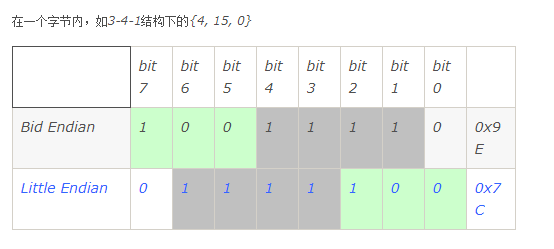
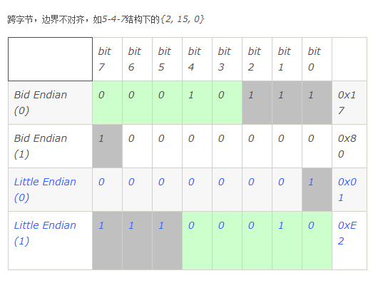

# 大小端
## 大小端存储示例
1. 假设一个32位 unsigned int型数据0x12 34 56 78，大端存储方式为0x12 34 56 78，小端存储方式为0x78 56 34 12。一般我们的x86电脑都是小端。
## 32位系统各个类型的存储示例
1. Byte类型（8bits）：大小端都一样，如0x34
2. Short类型（16bits）：大小端方式之间有差别。如：0x1234，大端是0x1234，小端是0x3412
3. Long类型（32bits）：大小端方式之间有差别。如：0x12345678，大端是0x12 34 56 78，小端是0x78 56 34 12
4. 位域：

