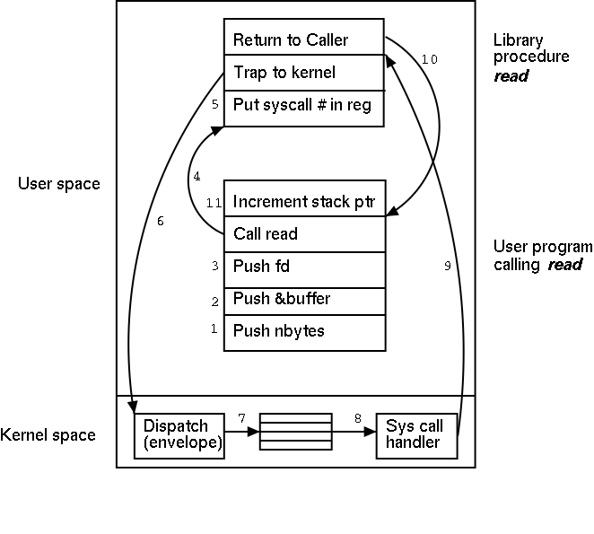

# 系统调用与函数调用

## 系统调用
1. 系统调用（system call），指运行在用户空间的应用程序向操作系统内核请求某些服务的调用过程。 打开应用程序时，操作系统是处在用户模式的，当使用系统调用函数，操作系统将进入内核模式，任务完成后又进入用户模式。系统经常在这两者之间切换。这种转换叫做上下文切换（context switching）。由于系统调用不考虑平台差异性，由内核直接提供，因而移植性较差（几乎无移植性）。

## 函数调用
1. 库函数（library function），是由用户或组织自己开发的，具有一定功能的函数集合，一般具有较好平台移植性，通过库文件（静态库或动态库）向程序员提供功能性调用。程序员无需关心平台差异，由库来屏蔽平台差异性。
## 两者区别
类型|函数调用|系统调用
---|---|---
移植性|平台移植性好|依赖于内核，不保证移植性
调用方式|调用函数库中的一段程序|调用系统内核的服务
运行空间|在用户空间执行|在内核空间执行
运行时间|它的运行时间属于“用户时间”|“系统时间”
开销|属于过程调用，调用开销较小|在用户空间和内核上下文环境间切换，开销较大
数量|库函数较多|UNIX中大约有90个系统调用，较少
