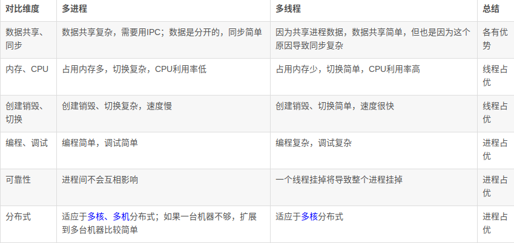

>> 参考：https://blog.csdn.net/return_true_hang/article/details/69665231

# 线程和进程的区别
1. 根本区别在于多进程中每个进程有自己的地址空间，线程则共享地址空间。所有其他区别都是因为这个区别产生的。
2. 线程使用公共变量或者内存的时候需要同步机制，但进程不用。
3. 速度。线程产生的速度快，通讯快，切换快，因为他们处于同一地址空间。 
4. 线程的资源利用率好。 

# 通信方式之间的差异
## 进程
1. socket就是其中一种通信方式
2. 其余见参考链接
## 线程
- **锁机制**
- - 互斥锁提供了以排他方式防止数据结构被并发修改的方法。
- - 读写锁允许多个线程同时读共享数据，而对写操作是互斥的。
- - 条件变量可以以原子的方式阻塞进程，直到某个特定条件为真为止。对条件的测试是在互斥锁的保护下进行的。条件变量始终与互斥锁一起使用。

# 进程与线程的选择

