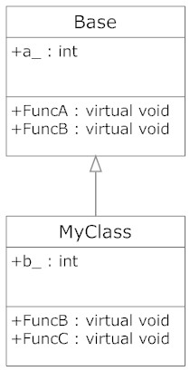
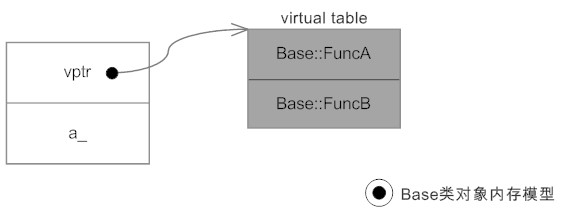
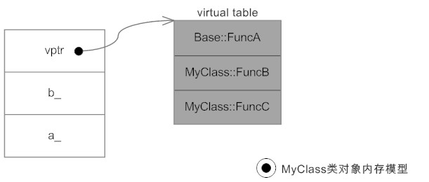

# 虚函数表

>> 参考：https://www.cnblogs.com/helloamigo/p/3592923.html

- 虚函数的作用主要是实现了多态机制，即用父类型别的指针指向其派生类的实例，然后通过父类的指针调用派生类的成员函数，这种技术可以让父类的指针有“多种形态”。

- 结果是Base类占8个字节，而MyClass占12个字节，增加的四个字节存放了一个虚表指针，该指针指向一张虚表，该表中存放的就是类中相关虚函数的入口地址，存放顺序同定义顺序。如下所示：




## 通过如下技巧即可调用虚函数（比较高级的技巧）
```
    typedef void (*FUNC)();     //此处与虚函数的返回值、参数一致

    Base ob;

    long **p = (long **)&ob;    // 指向虚表指针的指针
    FUNC fa = (FUNC)p[0][0];
    FUNC fb = (FUNC)p[0][1];

    fa();
    fb();
```
