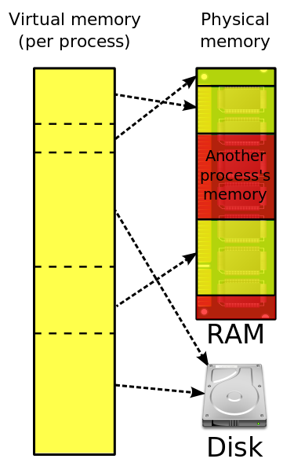

# 逻辑内存
>> logical memory 
- 逻辑内存是程序中实际用到的内存地址
# 物理内存
>> Physical memory
- 物理内存大小在应用中就是我们的内存条RAM
- 物理内存大小在CPU中指的就是CPU的地址线可以直接进行寻址的内存空间大小。比如8086只有20根地址线，那么它的寻址空间就是1MB，我们就说8086能支持1MB的物理内存，就算我们安装了128M的内存条在板子上，我们也只能说8086拥有1MB的物理内存空间。同理我们现在大部分使用的是32位的机子，32位的386以上CPU就可以支持最大4GB的物理内存空间了。
# 虚拟内存
>> Virtual memory

- 其实虚拟内存是一个概念，它包含了物理内存（Physical memory），也包含了硬盘（disk）
- 如果你的内存条是256M，你的程序却要创建一个2G的数据区，那么不是所有数据都能一起加载到内存（物理内存）中，势必有一部分数据要放到其他介质中（比如硬盘），待进程需要访问那部分数据时，在通过**调度**进入物理内存。所以，虚拟内存是进程运行时所有内存空间的总和，并且可能有一部分不在物理内存中，而物理内存就是我们平时所了解的内存条。关键的是不要把虚拟内存跟真实的插在主板上的内存条相挂钩，虚拟内存它是“虚拟的”不存在，假的啦，它只是内存管理的一种抽象.
# 内存分页机制
- 计算机会对虚拟内存地址空间（32位为4G）分页产生页（page），对物理内存地址空间（假设256M）分页产生页帧（page frame），这个页和页帧的大小是一样大的，所以虚拟内存页的个数势必要大于物理内存页帧的个数。
- 在计算机上有一个页表（page table），就是映射虚拟内存页到物理内存页的，更确切的说是**页号**到**页帧号**的映射，而且是一对一的映射。
- 但是问题来了，虚拟内存页的个数 > 物理内存页帧的个数，岂不是有些虚拟内存页的地址永远没有对应的物理内存地址空间？不是的，操作系统是这样处理的。操作系统有个页面失效（page fault）功能。操作系统找到一个**最少使用的页帧**，让它失效，并把它写入磁盘，随后把需要访问的页放到页帧中，并修改页表中的映射，这样就保证所有的页都有被调度的可能了。这就是处理虚拟内存地址到物理内存的步骤。
# 虚拟内存地址和物理内存地址
- 虚拟内存地址由页号（与页表中的页号关联）和偏移量组成。
- 页号对应的映射到一个页帧。
- 偏移量就是我上面说的页（或者页帧）的大小，即这个页（或者页帧）到底能存多少数据。
- 举个例子，有一个虚拟地址它的页号是4，偏移量是20，那么他的寻址过程是这样的：首先到页表中找到页号4对应的页帧号（比如为8），如果页不在内存中，则用失效机制调入页，否则把页帧号和偏移量传给MMU（CPU的内存管理单元）组成一个物理上真正存在的地址，接着就是访问物理内存中的数据了。
- 总结起来说，虚拟内存地址的大小是与地址总线位数相关，物理内存地址的大小跟物理内存条的容量相关。

