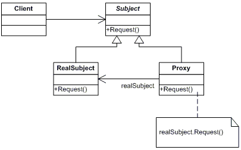

# 代理模式 PROXY

>> 代理模式：为其他对象提供一种代理以控制对这个对象的访问。这样实现了业务和核心功能分离(我的理解是对象尽管实现关键功能，而代理来检测其合法性)。

## UML图


*实心箭头表示包含关系*

*空心三角表示继承关系*
## 角色
- Subject: 抽象角色。声明真实对象和代理对象的共同接口。
- Proxy: 代理角色。代理对象与真实对象实现相同的接口，所以它能够在任何时刻都能够代理真实对象。**代理角色内部包含有对真实对象的引用，所以她可以操作真实对象，同时也可以附加其他的操作，相当于对真实对象进行封装。**
- RealSubject: 真实角色。它代表着真实对象，是我们最终要引用的对象
## 举例
- 假若你有一个工厂开始是生产手机的，但是它现在不想自己生产了，它把自己的东西交给了一家代工厂富士康去生产，那么便有了下面的代码去构建。
```
//统一的抽象接口 IFactory
class IFactory
{
public:
	IFactory(){}
	virtual void makeProduct() = 0;
};
//你的手机工厂
class PhoneFactory : IFactory
{
public:
	PhoneFactory(){}
	void makeProduct()
	{
		cout<<"生产手机"<<endl;
	}
};
//专门做代工的代理工厂富士康
class FoxconnProxy : IFactory
{
public:
	FoxconnProxy(IFactory* factory)
	{
		m_real = factory;
	}
	void makeProduct()
	{
		m_real->makeProduct();
	}
private:
	IFactory* m_real;
};
//客户端
	IFactory* factory = new PhoneFactory();
	FoxconnProxy* proxy =  new FoxconnProxy(factory);
	proxy->makeProduct();
```
## 总结
>> 看了uml图和上面的代码你会可能会发现，先访问代理类再访问真正要访问的对象。似乎这样有点多此一举的味道，其实不然。
- 代理类可以在真正的类执行之前，进行预处理。 
- 比如富士康生产的手机之前可能会坚持元器件是否合格，不合格就不生产等。
- 在比如你有一个系统实现了登陆功能，在用户登录时, 真正的登录类和代理登录类都实现了Login接口, 不同的是Proxy类的方法中增加了用户是否合法的判断, 只有合法时才去调用真正登录类的login方法. 用户访问的其实是Proxy的login方法.这都是代理模式的优点。
- 而且采用代理模式的话，并且你可以随时更改代理。