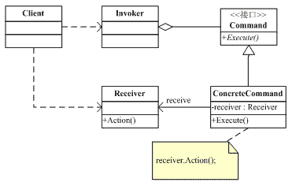

# 命令模式

## UML

*虚箭头：依赖(Dependency)。方法参数需要传入另一个类的对象，就表示依赖这个类。*

*菱形箭头：聚合(Aggregation)。表示has-a的关系，是一种不稳定的包含关系。较强于一般关联,有整体与局部的关系,并且没有了整体,局部也可单独存在。如公司和员工的关系，公司包含员工，但如果公司倒闭，员工依然可以换公司。*
## 角色
- Command类：用来声明执行操作的接口。
- ConcreteCommand类：将一个接收者对象绑定与一个动作，调用接收者相应的操作，以实现Excute。
- Invoker类：执行所有命令Excute。
- Receiver类：知道如何实施与执行一个与请求相关的操作，任何类都可能作为一个接收者。
## 作用
- 在需要的情况下，可以较容易地将命令记入日志。
- 可以容易地实现对请求的撤销和重做。
- 由于加进新的具体命令类不影响其他的类，因此增加新的具体命令类很容易。
- 命令模式把请求一个操作的对象与知道怎么执行一个操作的对象分隔开。
## 餐厅服务员模型
[代码](waiter.cpp)
## 撤销模型
[代码](undo.cpp)