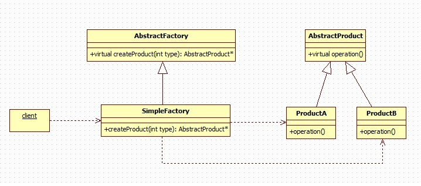
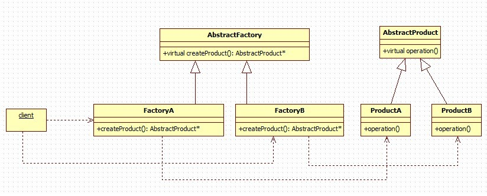
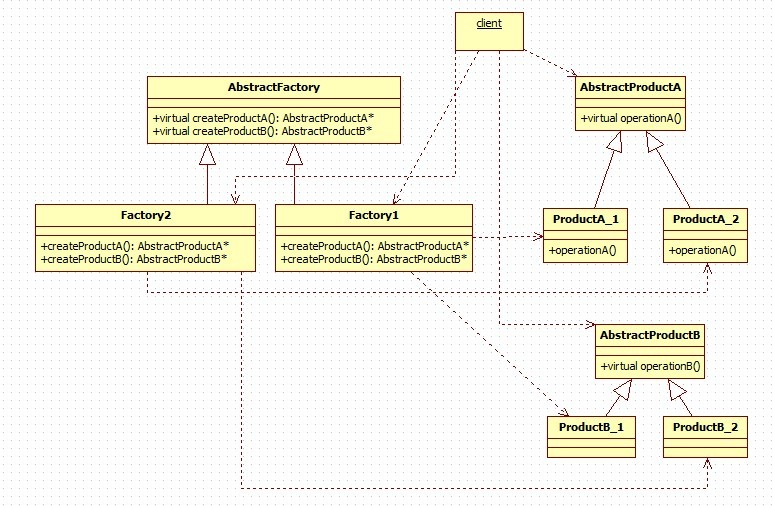

# 工厂模式

>> 特点：They offers the interface for creating a family of related objects, without explicitly specifying their classes. (即使用者尽管使用基类来代表实例即可，工厂和产品都一样用基类表示，改动的话)

>> 面向对象六大原则：http://www.cnblogs.com/alunchen/p/7110116.html

>> 链接：https://www.cnblogs.com/cxjchen/p/3143633.html

>> 工厂模式和抽象工厂模式：https://blog.csdn.net/linwh8/article/details/51232834

## 1.简单工厂模式

1. 注意工厂的基类中，创建产品的函数有参数，返回值是通过参数决定的，里面可能会有switch、if语句
2. 所有产品有一个共同的抽象基类，这样可以遵循依赖倒置原则
3. 方便添加新的产品子类，每次只需要修改工厂类传递的类型值就行了。
4. 可参看代码，在文件夹中
5. 例如部署多种数据库的情况，可能在不同的地方要使用不同的数据库，此时只需要在**配置文件**中设定数据库的类型，每次再根据类型生成实例，这样，不管下面的数据库类型怎么变化，在客户端看来都是只有一个AbstractProduct，使用的时候根本无需修改代码。
6. 提供的类型也可以用比较便于识别的字符串（宏就可以），这样不用记很长的类名，还可以保存为配置文件。
7. 缺点是违背了开放-封闭原则（软件对扩展开放，对修改关闭。修改指的是修改基类）
## 2.工厂模式

1. 既然每次都要判断，那我就把这些判断都生成一个工厂子类，这样，每次添加产品子类的时候，只需再添加一个工厂子类就可以了。这样就完美的遵循了开放-封闭原则。
2. 缺点是每次新增产品，还要新增新的工厂
3. 优点是要换产品，只需要换工厂就行
4. 可参看代码，在文件夹中

## 3.抽象工厂模式

1. 抽象工厂模式就变得比工厂模式更为复杂，就像上面提到的缺点一样，**工厂模式和简单工厂模式要求产品子类必须要是同一类型的，拥有共同的方法，这就限制了产品子类的扩展**。于是为了更加方便的扩展，抽象工厂模式就将同一类的产品子类归为一类，让他们继承同一个抽象子类，我们可以把他们一起视作一组，然后好几组产品构成一族。
2. 此时，客户端要使用时必须知道是哪一个工厂并且是哪一组的产品抽象类。每一个工厂子类负责产生一族产品，而子类的一种方法产生一种类型的产品。在客户端看来只有AbstractProductA和AbstractProductB两种产品，使用的时候也是直接使用这两种产品。而通过工厂来识别是属于哪一族产品。
3. 使用场景：例如Linux和windows两种操作系统下，有2个挂件A和B，他们在Linux和Windows下面的实现方式不同，Factory1负责产生能在Linux下运行的挂件A和B，Factory2负责产生能在Windows下运行的挂件A和B，这样如果系统环境发生变化了，我们只需要修改工厂就行了。

## 工厂模式和抽象工厂模式两种模式的差异
- 工厂模式： 
- - 只有一个抽象工厂，能生成许多实例化工厂。 
- - 只有一个抽象产品，能生成许多实例化产品。 
- - 也就是说，工厂模式下，抽象工厂内只有一种抽象类产品，即这类工厂只能生产一类产品。

- 抽象工厂模式： 
- - 只有一个抽象工厂，能生成许多实例化工厂。 
- - 拥有多个抽象类产品，每个抽象类产品能生成许多实例化产品。 
- - 也就是说，抽象工厂模式下，抽象工厂内有多种抽象类产品，即这类工厂能生产多类产品