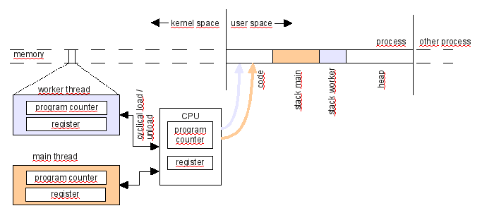
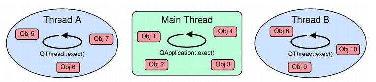

# 线程
## 整体概念


1. 每个线程都有自己的堆栈，这就意味着每个线程都有堆栈保存自己的函数调用记录以及局部变量。
2. 与进程不同的是,线程共享相同的地址空间，如上图中同时使用code区。
3. 程序计数器（PC指针）和不活动线程的寄存器保存在内核空间中，而正在使用的线程的PC指针和寄存器数据则保存在CPU中。
4. Qt中使用多线程的情况：a.是充分使用CPU多核的特性提高速度；b.防止GUI线程被一个需长时间运行的算法阻塞住
## Reentrancy and Thread-Safety
1. 线程安全（Thread-Safety）函数是指：在多线程中，不同线程同时调用一个函数时，若此函数是线程安全的，那么不用担心调用共享数据会不会发生冲突，因为函数中共享数据的访问是序列化的（serialized）
2. 可重入（reentrant）函数是指：使用只有在使用用户自己的数据时才安全，否则不一定。
3. a thread-safe function is always reentrant, but a reentrant function is not always thread-safe.
4. Qt在只有觉得这个类理应用在多线程中时，才会将这个类设计成线程安全的。如果一个类既不是线程安全的，也不是可重入的，那么这个类就不应该在多线程中同时被调用！

## 举例说明
```
//可重用
class Counter
{
public:
    Counter() { n = 0; }

    void increment() { ++n; }
    void decrement() { --n; }
    int value() const { return n; }

private:
    int n;
};
```
1. 上述类是可重用的，但不是线程安全的。
2. ++n不是线程安全的，它分为三步操作：a.将n装载到一个寄存器上；b.增加寄存器的值；c.将寄存器的值返回到内存中
3. 当两个线程同时操作时，可能每个线程都停在第二步，那么下一步将寄存器的值返回到内存就会发生错误。
```
//线程安全
class Counter
{
public:
    Counter() { n = 0; }

    void increment() { QMutexLocker locker(&mutex); ++n; }
    void decrement() { QMutexLocker locker(&mutex); --n; }
    int value() const { QMutexLocker locker(&mutex); return n; }

private:
    mutable QMutex mutex;
    int n;
};
```
1. 注意其中用到了mutable，是因为被mutable修饰的变量，将永远处于可变的状态，即使在一个const函数。
## 线程和QObjects的关系
1. QThread继承自QObject。QObject可以使用在不同的线程，也可以发送信号来调用其他线程的函数。
2. QObject是可重入的。 它的大部分非GUI子类（如QTimer，QTcpSocket，QUdpSocket和QProcess）也是可重入的，这些类被设计为在单个线程内创建和使用，而在多线程中使用时会不安全。
3. 一个QObject的子类必须创建在其父类对象所在的线程中，这就意味着永远都不要把QThread对象作为一个本线程某对象的父类，因为QThread对象本身创建在其他线程
4. 要确保在删除QThread之前，所有的在本线程中创建的对象都delete了。
5. 虽然QObject是可重入的，但是所有的QWidget还有其子类均是不可重入的，它们只能在主线程中使用， QCoreApplication::exec()也必须写在主线程
## 线程的事件轮询

1. 主线程调用QCoreApplication::exec()打开事件轮询（Event Loop），子线程调用QThread::exec()来打开。其中QThread::exec()在run()函数中被调用。
2. 线程中的事件轮询使得不同线程间信号与槽的使用成为了可能。
3. 一个QObject对象所处线程可通过QObject::thread()来获得
4. QObject::moveToThread()函数可以是一个QObject对象以及其子类移动到另一个线程中
5. 从别的线程来delete本线程的QObject是不安全的，除非能保证在delete的那一时刻对象没有处理事件。
6. You can manually post events to any object in any thread at any time using the thread-safe function QCoreApplication::postEvent(). The events will automatically be dispatched by the event loop of the thread where the object was created.
## 跨线程的信号与槽
1. 线程亲密性（Thread Affinity）是指一个QObject创建在这个线程中。
2. If QObjects are created within QThread::run(), they cannot become children of the QThread object because the QThread does not live in the thread that calls QThread::run().
- Auto Connection (default) If the signal is emitted in the thread which the receiving object has affinity then the behavior is the same as the Direct Connection. Otherwise, the behavior is the same as the Queued Connection."
- Direct Connection The slot is invoked immediately, when the signal is emitted. The slot is executed in the emitter's thread, which is not necessarily the receiver's thread.
- Queued Connection The slot is invoked when control returns to the event loop of the receiver's thread. The slot is executed in the receiver's thread.
- Blocking Queued Connection The slot is invoked as for the Queued Connection, except the current thread blocks until the slot returns.（Note: Using this type to connect objects in the same thread will cause deadlock.为什么？？）
- Unique Connection The behavior is the same as the Auto Connection, but the connection is made only if it does not duplicate an existing connection. i.e., if the same signal is already connected to the same slot for the same pair of objects, then the connection is not made and connect() returns false.